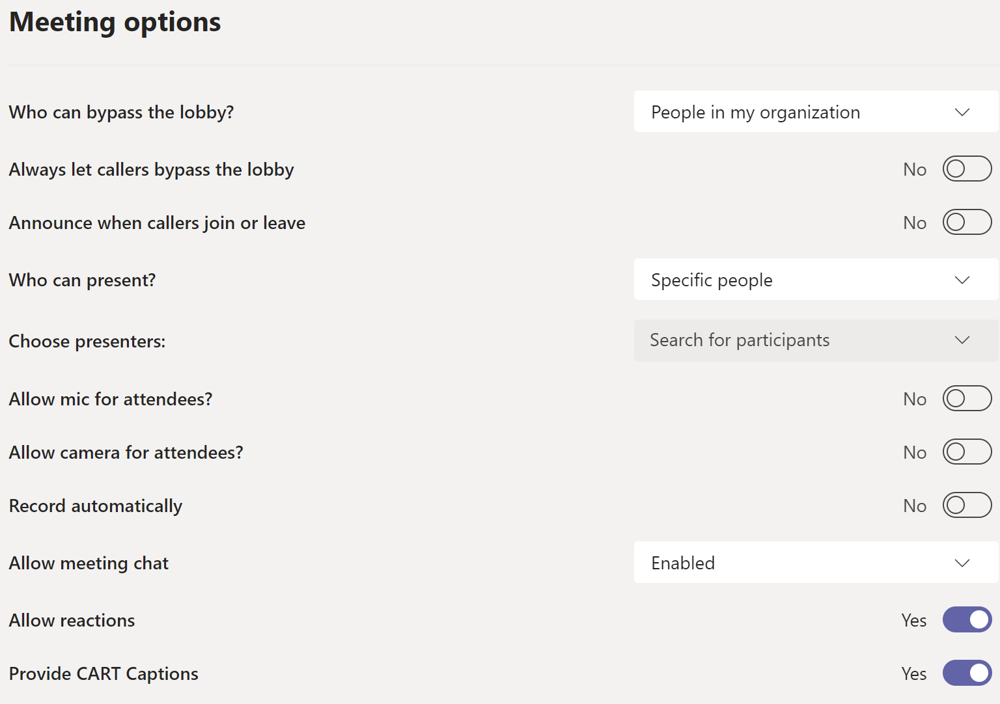

# Tutorial - Create a Meeting using Microsoft Teams

This will show the steps for setting up a public meeting as part of a recurring series that happens at the end of a release/sprint. This assumes a company using Microsoft Teams, and running the agenda creation and finalization using respectively GitHub Discussions (private or public repo) and Issues (public repo).

1. Create the draft meeting agenda as a discussion. Kick off the discussion with what you know. [Example](https://github.com/lyledodge-playground-organization/community/discussions/4).
    1. Naming conventions and labels are useful here, the example above uses two labels - "meeting agenda" and "end user community", as well as a standard naming on the title of the issue which includes the date in the format "Meeting Purpose" - YYYY.MM for easy sorting/filtering.
1. When the meeting agenda has been finalized, choose "Create issue from discussion". Paste your finalized agenda into the new issue (which may or may not be using an agenda template). You can link to the discussion if you want to have an easy context trail. [Example](https://github.com/lyledodge-playground-organization/community/issues/5).
1. Create the meeting in Microsoft Teams, with a link in the description to the meeting agenda (the GitHub Issue from the step above). Modify the **Response options** and **Require registration** options to fit your meeting requirements.
    1. Save the meeting, then go back into the meeting after a few seconds. In the meeting information / description field, go to the bottom and click on **Meeting options**. Some example configurations:
        1. Wide open meeting with audio/video enabled for anyone
        
        1. Specific people in your organization presenting
        
        1. Specific people in the meeting only
        
    1. Save the meeting options
    1. Go back into the meeting, and copy any information you need out of the meeting invite - i.e. the "Click here to join the meeting" link, and any dial in information you want to have listed publicly. Alternatively, you may decide only invited people receive that link.
